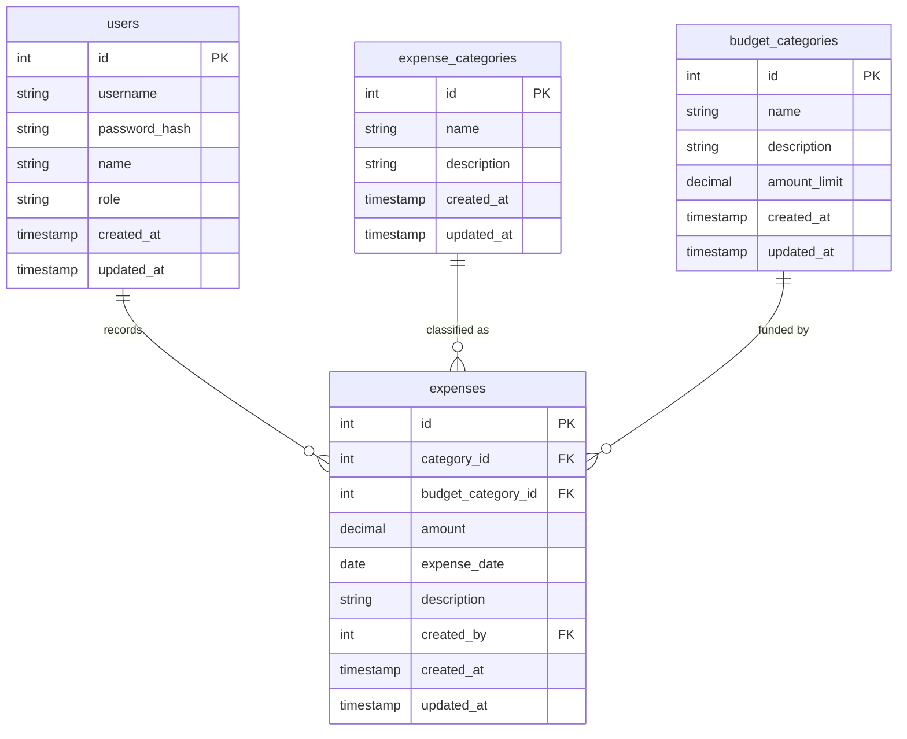

# แผนการออกแบบและพัฒนา (plan.md)
## ระบบควบคุมและติดตามค่าสาธารณูปโภก (e-utilities-cost)

ระบบนี้เป็นเว็บแอปพลิเคชันสำหรับควบคุมและติดตามค่าใช้จ่ายสาธารณูปโภค (เช่น ค่าน้ำ, ค่าไฟ, ค่าอินเทอร์เน็ต) โดยมีระบบจำแนกประเภทและหมวดเงินที่เบิกจ่าย พร้อมทั้งรายงานในรูปแบบแดชบอร์ดสรุปผลและกราฟวิเคราะห์ข้อมูลเพื่อควบคุมงบประมาณได้อย่างมีประสิทธิภาพ

---

## 1. การออกแบบสถาปัตยกรรมระบบ (System Architecture)

ระบบประกอบด้วย 3 ส่วนหลัก (Three-Tier Architecture):
1. **Frontend (Client Layer):** React (Vite) พัฒนาด้วย HTML/CSS/JavaScript ในรูปแบบ Single Page Application (SPA) เน้น UI ที่ทันสมัย ลื่นไหล และทำงานแบบ Responsive
2. **Backend (Application Layer):** Node.js + Express.js จัดการ API Routing, Authentication (JWT), Business Logic, และติดต่อกับฐานข้อมูลผ่าน Sequelize ORM
3. **Database (Data Layer):** MariaDB เป็นระบบจัดการฐานข้อมูลหลักสำหรับเก็บข้อมูลผู้ใช้ หมวดเงิน ประเภทค่าใช้จ่าย และรายการค่าใช้จ่าย

---

## 2. การออกแบบฐานข้อมูล (Database Schema Design)

ฐานข้อมูลมีชื่อว่า `e_utilities_cost` ประกอบด้วยตารางดังต่อไปนี้:

### รายละเอียดตาราง:

#### 1. ตารางผู้ใช้งาน (`users`)
- `id` (INT, PK, Auto-increment): รหัสผู้ใช้
- `username` (VARCHAR(50), Unique, Not Null): ชื่อผู้ใช้สำหรับ Login
- `password_hash` (VARCHAR(255), Not Null): รหัสผ่านที่เข้ารหัสด้วย bcrypt
- `name` (VARCHAR(100), Not Null): ชื่อ-นามสกุลจริง
- `role` (VARCHAR(20), Default 'user'): บทบาทผู้ใช้ (เช่น admin, user)
- `created_at` / `updated_at`: วันเวลาสร้าง/อัปเดต

#### 2. ตารางหมวดเงินงบประมาณ (`budget_categories`)
- `id` (INT, PK, Auto-increment): รหัสหมวดเงิน
- `name` (VARCHAR(100), Unique, Not Null): ชื่อหมวดเงิน (เช่น งบบริหาร, งบพัฒนา, งบฉุกเฉิน)
- `description` (TEXT): คำอธิบาย
- `amount_limit` (DECIMAL(12,2), Not Null): วงเงินงบประมาณต่อเดือน
- `created_at` / `updated_at`: วันเวลาสร้าง/อัปเดต

#### 3. ตารางประเภทค่าใช้จ่าย (`expense_categories`)
- `id` (INT, PK, Auto-increment): รหัสประเภทค่าสาธารณูปโภก
- `name` (VARCHAR(100), Unique, Not Null): ชื่อประเภท (เช่น ค่าไฟฟ้า, ค่าน้ำประปา, ค่าบริการอินเทอร์เน็ต)
- `description` (TEXT): คำอธิบาย
- `created_at` / `updated_at`: วันเวลาสร้าง/อัปเดต

#### 4. ตารางรายการค่าใช้จ่ายจริง (`expenses`)
- `id` (INT, PK, Auto-increment): รหัสรายการ
- `category_id` (INT, FK, Not Null): อ้างอิงประเภทค่าใช้จ่าย
- `budget_category_id` (INT, FK, Not Null): อ้างอิงหมวดเงินที่เบิกจ่าย
- `amount` (DECIMAL(12,2), Not Null): จำนวนเงิน
- `expense_date` (DATE, Not Null): วันที่เกิดค่าใช้จ่ายจริง
- `description` (TEXT): คำอธิบายเพิ่มเติม
- `created_by` (INT, FK, Not Null): อ้างอิงผู้ใช้งานที่บันทึกข้อมูล
- `created_at` / `updated_at`: วันเวลาสร้าง/อัปเดต

---

## 3. การออกแบบ API Endpoints (Backend API)

API ทั้งหมดจะขึ้นต้นด้วย `/api/v1` และใช้ JWT Token ใน Header (`Authorization: Bearer <token>`) สำหรับเส้นทางที่ต้องผ่านการตรวจสอบสิทธิ์

### ระบบ Authentication
- `POST /api/v1/auth/register` - ลงทะเบียนผู้ใช้ใหม่
- `POST /api/v1/auth/login` - เข้าสู่ระบบ (คืนค่า JWT token และข้อมูลผู้ใช้)
- `GET /api/v1/auth/me` - ตรวจสอบข้อมูลผู้ใช้ปัจจุบัน (ใช้ Token)

### จัดการหมวดงบประมาณ (Budget Categories)
- `GET /api/v1/budgets` - ดึงข้อมูลหมวดงบประมาณทั้งหมด
- `POST /api/v1/budgets` - เพิ่มหมวดงบประมาณ (Admin)
- `PUT /api/v1/budgets/:id` - แก้ไขหมวดงบประมาณ (Admin)
- `DELETE /api/v1/budgets/:id` - ลบหมวดงบประมาณ (Admin)

### จัดการประเภทค่าสาธารณูปโภก (Expense Categories)
- `GET /api/v1/categories` - ดึงประเภทค่าใช้จ่ายทั้งหมด
- `POST /api/v1/categories` - เพิ่มประเภทค่าใช้จ่าย (Admin)
- `PUT /api/v1/categories/:id` - แก้ไขประเภทค่าใช้จ่าย (Admin)
- `DELETE /api/v1/categories/:id` - ลบประเภทค่าใช้จ่าย (Admin)

### จัดการรายการค่าใช้จ่าย (Expenses)
- `GET /api/v1/expenses` - ดึงรายการค่าใช้จ่ายทั้งหมด (รองรับ Query strings สำหรับฟิลเตอร์ช่วงเวลา/ประเภท)
- `POST /api/v1/expenses` - บันทึกค่าใช้จ่ายใหม่
- `PUT /api/v1/expenses/:id` - แก้ไขค่าใช้จ่าย
- `DELETE /api/v1/expenses/:id` - ลบค่าใช้จ่าย

### รายงานและวิเคราะห์ (Dashboard & Analytics)
- `GET /api/v1/dashboard/summary` - สรุปภาพรวมรายเดือน (ยอดรวม, เปรียบเทียบกับเดือนที่แล้ว, เปรียบเทียบกับงบประมาณที่จำกัดไว้)
- `GET /api/v1/dashboard/charts` - ข้อมูลสำหรับพล็อตแผนภูมิต่างๆ (ยอดแยกตามประเภท, ยอดแยกตามหมวดเงิน, แนวโน้มรายเดือน)
- `GET /api/v1/dashboard/reports` - รายงานสรุปผลรายปี หรือเปรียบเทียบข้อมูลย้อนหลังระหว่างปี

---

## 4. โครงสร้างส่วนติดต่อผู้ใช้งาน (Frontend UI Flow)

1. **หน้าเข้าสู่ระบบ (Login Page):** หน้าสำหรับตรวจสอบสิทธิ์เข้าใช้งานระบบ
2. **หน้าแดชบอร์ด (Dashboard Page):** แสดงผลสรุป ยอดรวมค่าใช้จ่ายปัจจุบัน, เปรียบเทียบกับวงเงินงบประมาณ (Budget Limit Alert), แผนภูมิแท่งเปรียบเทียบแต่ละเดือน, และแผนภูมิวงกลมแยกตามประเภท
3. **จัดการประเภทและงบประมาณ (Setup/Categories Page):** หน้าสำหรับเพิ่ม/ลบ/แก้ไข ประเภทค่าสาธารณูปโภกและหมวดเงิน
4. **จัดการรายการค่าใช้จ่าย (Expenses Page):** หน้าแสดงตารางบันทึกค่าใช้จ่ายทั้งหมด พร้อมฟอร์มเพิ่ม/แก้ไข/ลบ และระบบกรองข้อมูล (Filter)
5. **หน้าวิเคราะห์รายงาน (Reports Page):** ค้นหารายงานย้อนหลังรายปี/รายเดือน และทำกราฟเปรียบเทียบข้อมูลข้ามปี
kokplp